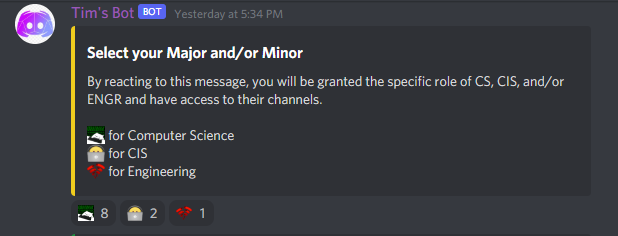
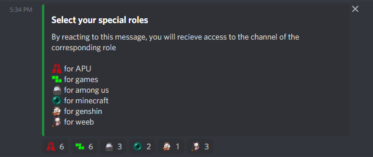
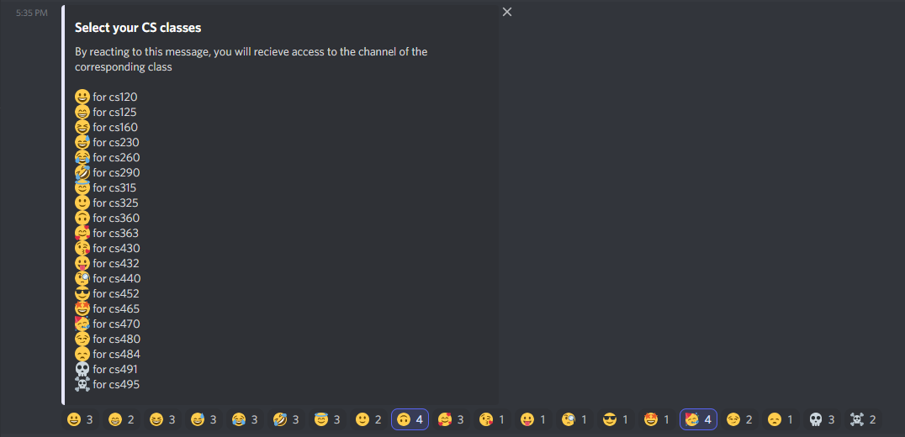
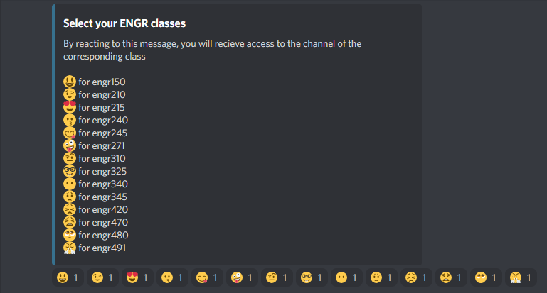

# Discord Bot - Tim's Bot

This bot is for Role Management in a Discord Server in which I am part of. Our
Discord Server is an unofficial server for Azusa Pacific Unversity's ECS Department.
In this server, we have channels for most of the classes and it is just a place
for us to hang out and get help for classes. Before, we, the admins, had to manually
put the roles of each person to give them access to the channels.

## How to install the project dependencies

In your Terminal or Command Prompt, run the following at the root of the
project directory:

```
$ npm i --save
```

## How to configure the environment variables

1. Create a `.env` file, by renaming the provided `.sample.env`
2. Add your Discord Bot's Token and the ID of the Discord channel that you want
the bot to listen to the `.env` file

## How to run the project using NodeJS

In your Terminal or Command Prompt, run the following at the root of the
project directory to run the discord bot:

```
$ npm start
```

## Images of Embeds




